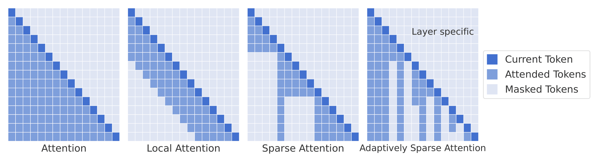

# Adaptively Sparse Attention

This repo contains code for the paper [Dynamic Context Pruning for Efficient and Interpretable Autoregressive Transformers](https://arxiv.org/abs/2305.15805).

Adaptively Sparse Attention adapts Autoregressive Transformers giving them the ability to drop irrelevant tokens in the sequence.

<p align="center">
  
</p>

We can thus enhance interpretability by highlighting the most relevant tokens in the sequence, while also reducing the computational cost of the model during inference.

An example of the droppig mechanism is shown below:

<p align="center">
  <video src="assets/image.mp4" width="800" />
</p>

Tokens are generated one by one and arrows indicate the previous tokens dropped by the model.


## Requirements
To install the requirements, run:

```python
pip install -r requirements.txt
```

## Training
To finetune pretrained model, run:

```python
python train.py --log_dir gpt2-sparse --batch_size 6 --entmax_weight_scheduler cosine_1_8_25000 --sparse_attention true --pretrained gpt2 --int_n_embd 64
```

This will generate a folder `gpt2-sparse` with tensorboard logs under the `logs` folder. Try `python train.py --help` for more options.

## Generation/Inference
To generate text from a finetuned model, run:

```python
python generate.py --model_path <folder-under-logs> --checkpoint <spcify-checkpoint>
```

## Citation
If you find this repo useful, please cite our paper:

```bibtex
@article{anagnostidis2023dynamic,
  title={Dynamic Context Pruning for Efficient and Interpretable Autoregressive Transformers},
  author={Anagnostidis, Sotiris and Pavllo, Dario and Biggio, Luca and Noci, Lorenzo and Lucchi, Aurelien and Hoffmann, Thomas},
  journal={arXiv preprint arXiv:2305.15805},
  year={2023}
}
```

## Acknowledgements
This repo was heavily inspired by the following:

- https://github.com/karpathy/nanoGPT
- https://github.com/deep-spin/entmax/
